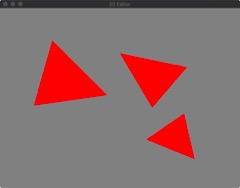
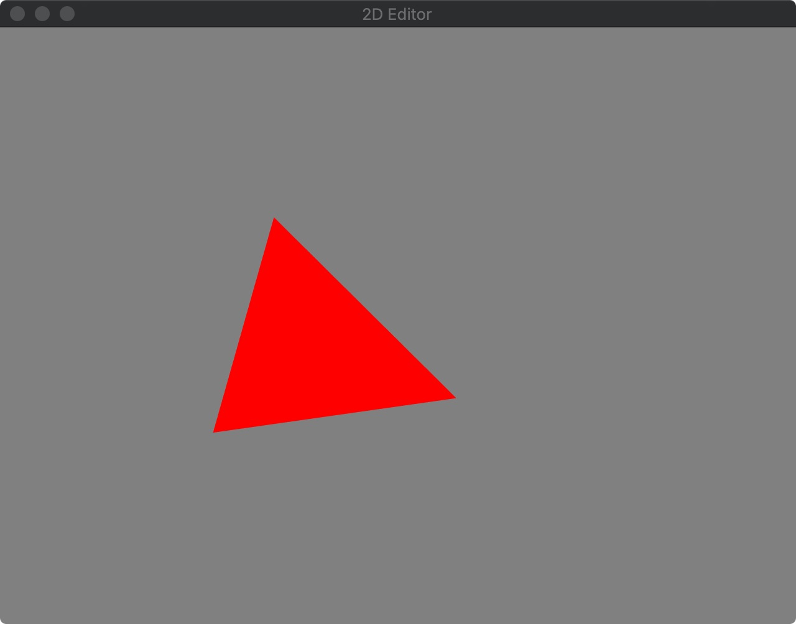
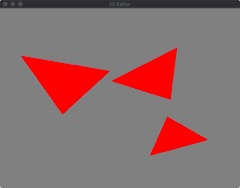
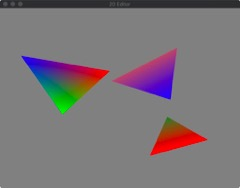
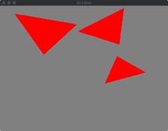
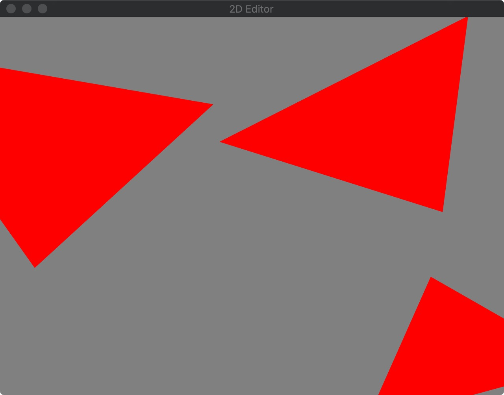

# Assignment 2: 2D Editor

Name: Wenkang Su

## Compilation instructions
In the terminal, after make in the build directory
go to the build directory:

run the file "Assignment2_bin"

## 1.1 Triangle Soup Editor

InsertionMode: If you hit the key "i" then you can start to create your triangles.
TranslationMode: If you hit the key "o" then you can start to move your triangles.
DeleteMode: If you hit the key "p" then you can delete the existing triangles.

## 1.2 Rotation Scale

During the translation mode, hit "k" & "l" to scale up and down the image by 25%
hit "h" and "j" to rotate the triangle. Before you do these operations, make sure you click a triangle first.

## 1.3 Colors

Hit "C" to enter color mode, click one of the vertices, and hit a number from 1-9.

## 1.4 View Control

Hit "=" & "-" to zoom in and zoom out
Hit WASD to move the view in 4 directions

## 1.5 Add Keyframe
Hit "F" to enter Keyframe mode, click any one of the triangles you created. The triangle will 
start to spin.

## 1.7 export SVG

Hit M to export SVG image
